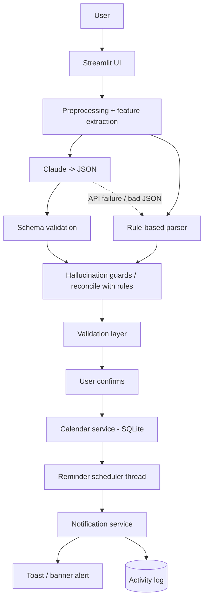

# AI-Powered Intelligent Calendar Reminder and Event Alert System (NLP + Task Automation)

Type "Remind me about my project presentation next Friday at 10 AM. Alert me one day before and one hour before."
and the system extracts a structured event, validates it, asks you to confirm, saves it to SQLite, schedules
reminders, fires alerts and logs everything.

## 1. AI approach (and why)
**Hybrid: LLM structured extraction + deterministic NLP cross-checks + controlled task automation.**
RAG was rejected (no document-retrieval problem). A free-roaming "agent" was rejected (unsafe, hard to evaluate).

| Option | Verdict |
|---|---|
| Traditional ML (CRF/NER) | Needs a big labelled set; poor on relative dates |
| Pure LLM | Flexible but can hallucinate dates/locations |
| RAG | No knowledge base to retrieve from |
| Agentic AI | Unnecessary risk; the LLM must NOT act on the system |
| **Hybrid (chosen)** | LLM understands language; regex parser verifies dates/times/reminders and works offline; Python performs only predefined actions |

**Where AI/NLP is used:** (1) intent detection, (2) title/category/priority/description extraction by Claude,
(3) temporal expression parsing (`nlp/temporal_parser.py`), (4) feature engineering (`nlp/features.py`),
(5) hallucination guards (`NLPExtractor._reconcile`). A normal calendar needs forms; this one understands free text.

**Claude is appropriate** because it follows strict JSON schemas at temperature 0 and handles varied phrasing. If you
prefer, the same `llm.complete(system, user)` interface can wrap another provider. Offline mode needs no key.

**Parameters.** `temperature=0.0` (extraction must be deterministic/repeatable), `max_tokens=600` (JSON is short),
`timeout=20s`, `max_retries=1` (responsive UI). Prompt `v1` (basic) vs `v2` (explicit temporal rules, "never invent",
reminder conversions, injection resistance, examples) are in `nlp/prompts.py`.

## 2. Architecture

**Why controlled actions are safer than giving the LLM OS access:** the model can only emit data; prompt injection
in user text cannot make it run commands, delete files or exfiltrate data. Python exposes a closed set of functions,
validates every field, and a human confirms before saving.

## 3. Folder structure
```
ai_calendar_assistant/
├── app.py                    Streamlit UI (6 pages)
├── requirements.txt  .env.example  .gitignore  pytest.ini  README.md
├── config/settings.py        env-based config
├── models/schemas.py         EventExtraction + strict validation
├── nlp/  preprocessing.py  temporal_parser.py  rules.py  features.py  lexicon.py  prompts.py  extractor.py
├── services/ llm_service.py  validation.py  calendar_service.py  reminder_service.py  notification_service.py
├── database/ database.py  repositories.py
├── evaluation/ generate_dataset.py  metrics.py  evaluate.py  results/
├── data/evaluation_dataset.csv   (136 synthetic rows)
├── tests/    test_nlp.py test_validation.py test_calendar.py test_reminders.py conftest.py
└── notebooks/evaluation.ipynb
```
Design note: I used plain dataclasses + hand-written validation instead of Pydantic, and a `threading` scheduler instead
of APScheduler. Fewer dependencies, easier to explain in a viva, and it let the core be tested offline.

## 4. Setup (Windows + PyCharm)
1. Install Python 3.10+ from python.org (tick **Add python.exe to PATH**).
2. PyCharm -> **File > Open** -> select the `ai_calendar_assistant` folder.
3. Terminal (PyCharm bottom tab, PowerShell):
```
python -m venv .venv
.venv\Scripts\Activate.ps1
```
(If blocked: `Set-ExecutionPolicy -Scope CurrentUser RemoteSigned`, or use `.venv\Scripts\activate.bat` in cmd.)
Then in PyCharm: **Settings > Project > Python Interpreter > Add > Existing > .venv\Scripts\python.exe**.
```
pip install -r requirements.txt
copy .env.example .env
```
4. Edit `.env`, set `ANTHROPIC_API_KEY=` (key from console.anthropic.com). Skip this to run in offline mode.
5. Database is created automatically on first run (`data/calendar.db`).
6. Generate dataset (already included): `python -m evaluation.generate_dataset`
7. Tests: `pytest`
8. Run: `streamlit run app.py` -> opens http://localhost:8501

## 5. Deployment (Docker / Render / Railway)
This app is a Streamlit service, so the simplest cloud deployment is a container. A ready-to-use `Dockerfile` is included in the project root.

### Docker (recommended)
```bash
# build
docker build -t ai-calendar-assistant .

# run locally
docker run --rm -p 8501:8501 \
  -e PORT=8501 \
  -e ANTHROPIC_API_KEY=your_key_here \
  -v "${PWD}/data:/app/data" \
  ai-calendar-assistant
```

Notes:
- In containers, `data/calendar.db` is not persistent unless you mount a volume like `/app/data`.
- If you want the app to work without an Anthropic key, leave `ANTHROPIC_API_KEY` unset and the app falls back to offline rule-based extraction.
- The app listens on `0.0.0.0:$PORT`, so cloud deploys that provide a dynamic port work correctly.

### Render / Railway / similar PaaS
1. Connect the GitHub repo.
2. Set the build command to `pip install -r requirements.txt` or use the Dockerfile.
3. Start command: `streamlit run app.py --server.address 0.0.0.0 --server.port $PORT`.
4. Add environment variables:
   - `ANTHROPIC_API_KEY` (optional)
   - `USE_LLM=true`
   - `DB_PATH=/app/data/calendar.db` or a mounted persistent path
   - `PORT=8501`
5. Persist the database with a volume or external storage; otherwise events are lost on redeploy.

### Streamlit Community Cloud
This project can also be deployed to Streamlit Community Cloud by selecting the repo and setting the main file to `app.py`.
Set the same environment variables in the app settings and keep the database in a writable path if the app needs durable event storage.

## 6. Testing
Automated: `pytest -v` covers extraction, date/time/reminder parsing, schema validation, create/retrieve/update/delete,
search, reminder scheduling & firing, duplicate prevention, malformed AI output.
Manual plan: (a) each sentence in section 6; (b) empty input; (c) gibberish; (d) "Exam on 2020-01-05 at 3 PM" -> rejected;
(e) remove the API key -> still works offline; (f) put a wrong key -> warning + fallback; (g) save the same event twice -> blocked;
(h) edit time -> reminder times change; (i) delete event -> reminders vanish.

## 7. Lecturer demonstration script
1. `streamlit run app.py`. Show sidebar (AI toggle).
2. **Create Event** -> click *Fill demo: event in ~6 minutes* (text becomes "My AI project presentation is today at HH:MM PM. Remind me 5 minutes before.").
3. **Analyze with AI** -> show JSON, features, warnings, source (llm / rules).
4. **Confirm & Save**. Go to **Dashboard** -> pending reminder with countdown.
5. Wait ~1 minute (scheduler checks every 10 s, UI polls every 5 s). A toast/banner appears:
   **"Reminder: AI Project Presentation starts in 5 minutes."**
6. **Reminder Center** -> Triggered -> Complete; Activity log shows `reminder_triggered`.
7. Future event: *Fill demo: next Monday* -> shows two reminders (1 day, 1 hour). Mention the "next Monday" assumption warning.
8. **AI Test / Evaluation**: run "Meeting with John tomorrow at 3." (ambiguity warning) and "Exam on 2020-01-05 at 3 PM" (rejected).
9. Terminal: `python -m evaluation.evaluate` (+ `--compare` with key).

**Limitation to state:** reminders fire only while the app process runs; reminders missed while closed fire as "(late)" at next start.
Production would use an OS service / push notifications / e-mail.

## 8. Dataset, preprocessing, features
* `data/evaluation_dataset.csv`: 136 rows, **synthetic** (template-generated, seed 42, plus 21 hand-written edge cases from the brief).
  Not from Kaggle/any public source. Labels come from the template, not from running the parser.
  Columns: text,intent,title,date,time,reminder_minutes,category,expected_valid,note. Reference "now" = 2026-10-06 06:00.
* Preprocessing: Unicode/quote normalisation and whitespace collapse (safe); number-words -> digits only before time units;
  digits, colons, slashes and case are deliberately kept. Relative dates are resolved against a supplied `now`.
* Features (`nlp/features.py`, shown in the UI): intent indicator, date expression type, relative-date flag, time present/ambiguous,
  number of reminder expressions, category keyword, urgency flag, capitalised-entity candidates. With an LLM, "features" are the
  structured extraction itself plus these auxiliary features used for cross-checking.

## 9. Evaluation
`python -m evaluation.evaluate` (offline baseline) · `--mode llm --prompt v1|v2` · `--compare`.
Metrics: intent/date/time/reminder/category accuracy, title fuzzy-match, overall structured accuracy; task success, correct creation,
correct reminder scheduling, invalid-input handling, duplicate prevention; avg latency; LLM fallback rate; a 13-case reliability
suite (stub LLMs: malformed JSON, API failure, impossible date, hallucinated location/reminders, duplicates, past dates...).
Results (+ config: model, temperature, prompt version) are saved to `evaluation/results/*.json`.

**Honest reading of results.** The offline baseline scored 100% on my dataset when I ran it, but I wrote the parser and the
dataset templates together, so that number is optimistic and says little about unseen phrasing. The meaningful experiments are
(1) `--compare` v1 vs v2 with a real key, and (2) adding your own harder, differently-worded rows to the CSV. Expect failures
there and report them - analysing failures is where the marks are. Do not copy numbers from this README; copy from your run.

**Results template** (fill from your own run):
| System | Overall | Date | Time | Reminders | Task success | Fallback | Avg ms |
|---|---|---|---|---|---|---|---|
| rules | _run_ | _run_ | _run_ | _run_ | _run_ | _run_ | _run_ |
| llm-v1 | | | | | | | |
| llm-v2 | | | | | | | |

**Improvement loop:** v1 -> inspect `failures` in the JSON -> v2 prompt adds temporal rules, "never invent", reminder unit table,
examples -> rerun `--compare` -> report which is better and why, and keep the winning prompt in `PROMPT_VERSION`.

## 10. Responsible AI
| Risk | Mitigation implemented |
|---|---|
| Hallucination | Strict schema; location/description/reminders must be grounded in the text; rule-parser overrides LLM dates/times |
| Wrong date interpretation | Documented conventions, warnings for "next X"/"at 3", editable review form, confirm-before-save |
| Bad/malformed output, API failure | JSON parse + schema check + automatic offline fallback (logged) |
| Past/impossible dates | Validation layer rejects; reminders already in the past are skipped with a warning |
| Privacy | Local SQLite; only the typed sentence is sent to the API, and only if the AI toggle is on; no calendar dump is sent |
| Key security | `.env`, in `.gitignore`, never in code; rotate if leaked |
| Prompt injection | LLM has no tools; output is data only; prompt rule 8; validation |
| Missed reminders | Documented limitation; late reminders flagged |
| Data at rest | SQLite is unencrypted - future work (disk encryption / SQLCipher) |

## 11. Viva Q&A (short answers)
* **Why this approach?** Calendar text is varied (LLM strength) but dates must be exactly right (deterministic parser strength); neither alone is safe or flexible enough.
* **Where is AI used?** Intent/title/category/priority extraction by Claude; NLP temporal parsing and features; hallucination detection.
* **Why not a normal calendar?** No forms - free text in, structured validated event out, plus ambiguity handling.
* **How are dates extracted?** Regex patterns for ISO/month-day/day-month/weekday/relative expressions resolved against the current date, with year roll-over; LLM output is compared against it.
* **How do you prevent hallucination?** Schema validation, grounding checks, rule-parser override, temperature 0, "never invent" prompt, user confirmation.
* **How is output validated?** `EventExtraction.from_dict` (types/ranges/formats) then `validate_for_scheduling` (required fields, not past, <5 years).
* **How are reminders generated?** "N unit before" -> minutes offsets; stored with trigger time = start - offset; a scheduler thread checks every 10 s and atomically flips pending->triggered (so no duplicates).
* **How is automation controlled?** Closed set of Python functions; LLM output is data only.
* **If the API fails?** Caught, logged, rule-based extractor used, user told.
* **Metrics?** See section 8. **How improved?** Prompt v1 -> v2 comparison on identical data.
* **Limitations?** English only; local time zone only; app must be running; synthetic dataset; "next Friday" is ambiguous in human language.
* **Privacy?** Local storage, minimal data to API, `.env` secrets.
* **Future work:** time zones, recurring events, e-mail/desktop notifications, Google Calendar sync, real user data evaluation, speech input.

## 12. Rubric evidence
| Criterion | Evidence to show |
|---|---|
| Environment configured (Preprocessing 30%) | venv, `requirements.txt`, `.env.example`, PyCharm interpreter screenshot, `pytest` passing |
| Functionalities specified | Section 1-2, About page, objectives list in report |
| Data acquired / dataset prepared | `generate_dataset.py`, `evaluation_dataset.csv`, explanation of synthetic origin |
| Data preprocessing | `nlp/preprocessing.py`, `temporal_parser.py`, rationale in section 7 |
| Features engineered (AI 50%) | `nlp/features.py`, JSON features on AI Test page |
| Approach selected & justified | Section 1 comparison table |
| Prompt/model parameters selected | `config/settings.py`, `nlp/prompts.py`, temperature rationale |
| Implementation & testing | Source code, `pytest -v` output, reliability suite |
| Evaluation metrics & implementation (20%) | `evaluation/evaluate.py`, saved JSON |
| Results interpreted | Filled results table + failure analysis |
| Parameters/prompts adjusted | v1 vs v2 `--compare` table |
| Config/prompts saved | `evaluation/results/*.json` `config` block; prompts in source |
| Demonstrated | Section 6 script / screen recording |

## 13. Report outline (map each to your own measured results; no fake citations)
1 Introduction (background, problem, aim, objectives, scope) · 2 Technology review (NLP, LLMs, structured output, prompt engineering,
task automation, calendar assistants - cite only sources you actually read) · 3 Requirements (functional / non-functional / HW-SW) ·
4 Design (sections 2 diagrams, DB schema from `database/database.py`, sequence: UI->extractor->validator->calendar->scheduler->notifier) ·
5 Implementation · 6 Evaluation (dataset, setup, metrics, your tables/charts, failure analysis) · 7 Responsible AI · 8 Conclusion & future work.

## 14. Troubleshooting
| Problem | Fix |
|---|---|
| `streamlit` not recognised | Activate venv; `pip install -r requirements.txt`; or `python -m streamlit run app.py` |
| PowerShell blocks activation | `Set-ExecutionPolicy -Scope CurrentUser RemoteSigned` |
| `ModuleNotFoundError: config` | Run commands from the project root; mark root as *Sources Root* in PyCharm |
| "No API key found" | Create `.env` (not `.env.example`), set `ANTHROPIC_API_KEY`, restart Streamlit |
| API key rejected / timeout | App falls back to rules automatically; check key/internet |
| No alert appears | App must stay open; reminder must be in the future when saved; wait up to ~15 s; check Reminder Center |
| `st.fragment` / `run_every` error | Upgrade: `pip install -U streamlit` (needs >=1.37) |
| `database is locked` | Close other processes using `data/calendar.db`, delete it to reset |
| Model name error | Set `ANTHROPIC_MODEL` in `.env` to a model your account can use |
